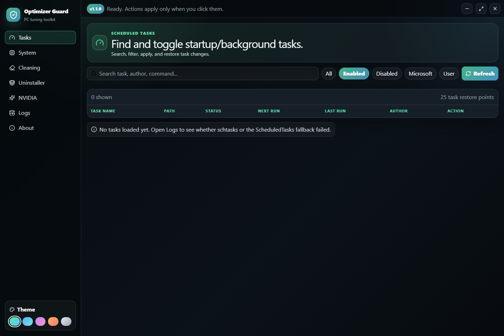
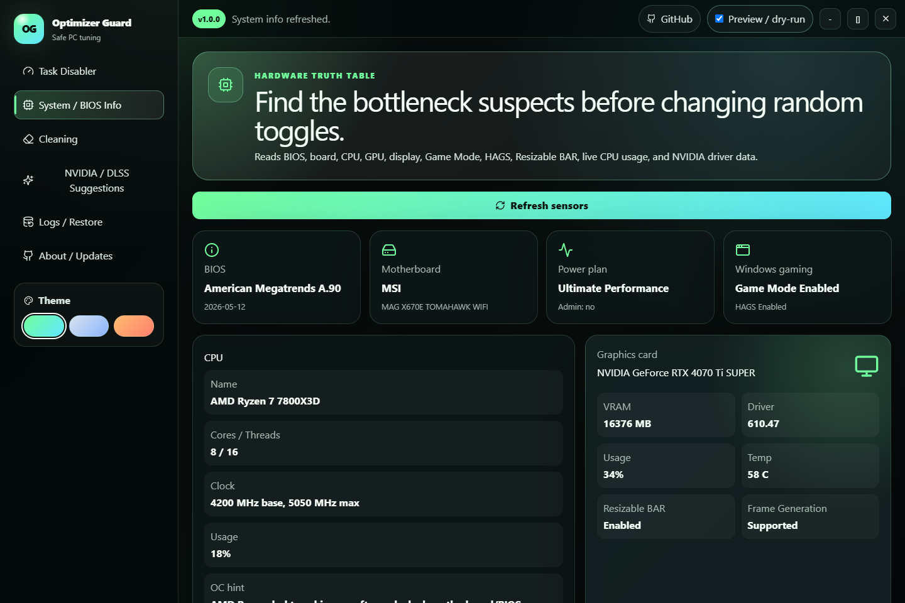
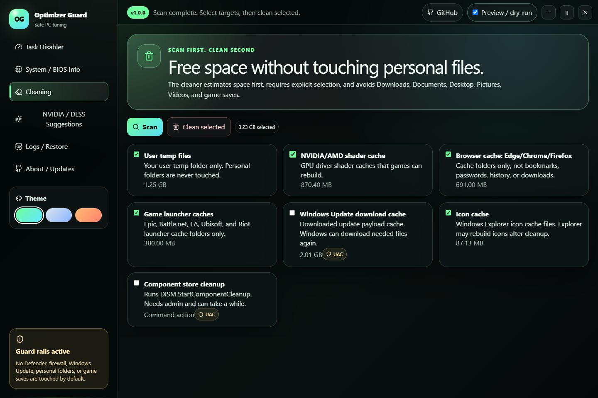
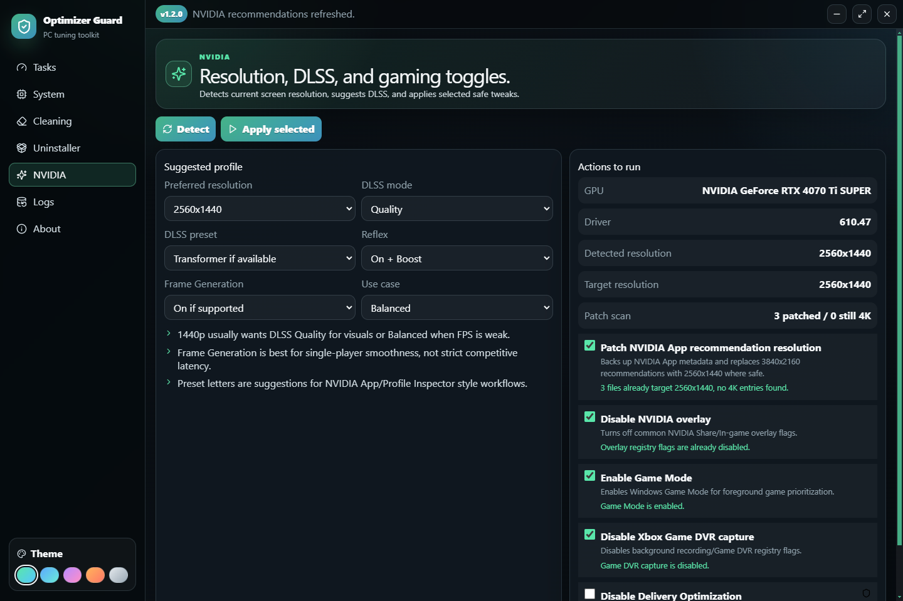
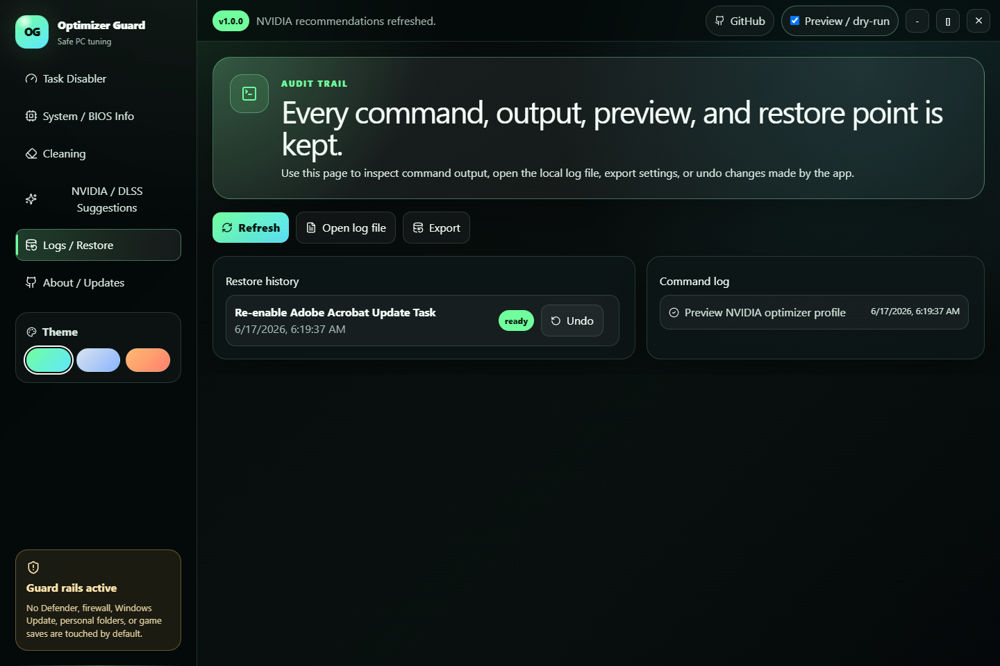
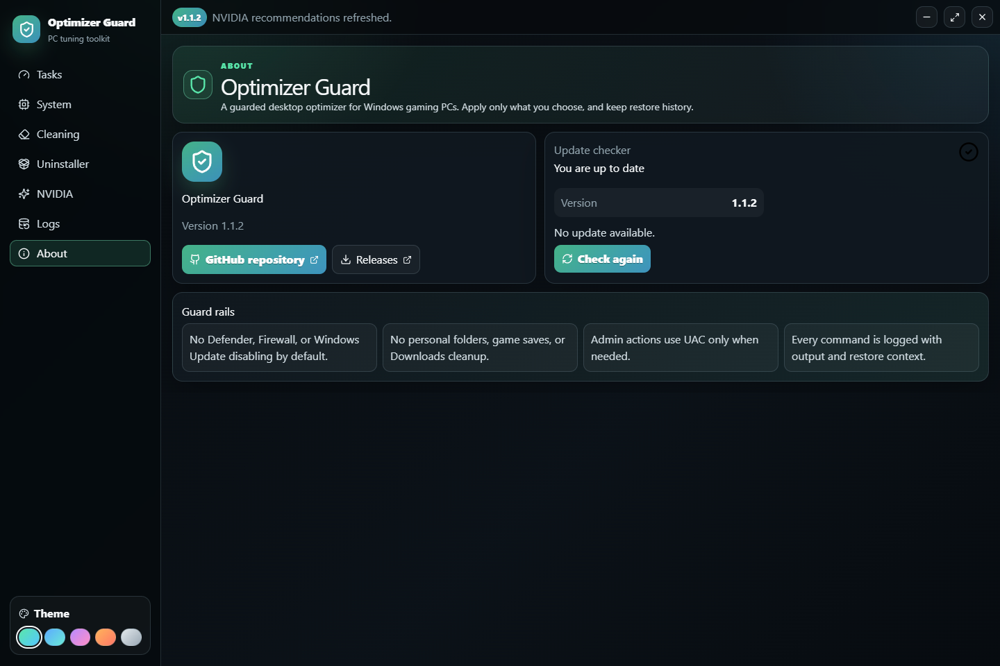

# Optimizer Guard

A modern Windows desktop app for safely tuning a gaming PC.

Scan your system, review suggested optimizations, apply only what you choose, and keep logs plus restore history for anything the app changes.

<p align="center">
  <em>Built with Electron, React, TypeScript, and Tailwind CSS</em>
</p>

---

## Screenshots

### Task Disabler



### System / BIOS Info



### Cleaning



### NVIDIA / DLSS



### Logs / Restore



### About / Updates



---

## Features

- Task Disabler - search scheduled tasks, filter Microsoft/user tasks, enable or disable selected entries, and keep restore history.
- System / BIOS Info - view BIOS, motherboard, CPU, GPU, display, Resizable BAR, Game Mode, and HAGS info in one place.
- Cleaning - scan first, select what to clean, then remove safe temp, shader, browser, launcher, update, log, dump, and app cache targets with estimates.
- NVIDIA / DLSS Suggestions - pick DLSS mode, preset style, Reflex, Frame Generation behavior, and preferred resolution.
- NVIDIA App resolution helper - patch safe NVIDIA App metadata from `3840x2160` to your preferred resolution, with backups.
- Gaming tweaks - disable NVIDIA overlay, enable Game Mode, and disable Xbox Game DVR capture when selected.
- Logs / Restore - every command is logged with output, dry-run state, elevation state, and restore actions where possible.
- Dry-run mode - preview actions before applying them.
- Admin guard - the app runs normally without admin and only asks for UAC when a selected action needs it.

## Safety

Optimizer Guard is intentionally conservative.

- It does not disable Defender, Firewall, Windows Update, or security services by default.
- It does not delete Downloads, Documents, Desktop, Pictures, Videos, or game saves.
- It does not run random internet scripts.
- Dangerous actions require confirmation.
- Admin actions are marked with a shield and request elevation only when needed.
- Cache cleaning may cause games or Windows to rebuild shaders/thumbnails after launch.
- Disabling Hyper-V may affect WSL2, Docker, VMs, Android emulators, and some security features.

## Quick Start

### Requirements

- Windows 10 or 11
- Node.js 18 or newer
- npm

### Install

```bash
git clone https://github.com/SyroxXploits/Optimizer-Guard.git
cd Optimizer-Guard
npm install
```

### Run in development

```bash
npm run dev
```

### Build a Windows release

```bash
npm run package:win
# Output lands in dist/
```

## Release

Download the latest Windows installer or portable build from:

https://github.com/SyroxXploits/Optimizer-Guard/releases

## Project Structure

```text
src/
|-- main/
|   |-- index.ts       # Electron window, IPC, lifecycle, screenshot capture mode
|   `-- optimizer.ts   # Windows commands, task parsing, cleaning, NVIDIA/system logic
|-- preload/
|   `-- index.ts       # Secure contextBridge API plus demo screenshot data
|-- renderer/
|   |-- index.html
|   `-- src/
|       |-- App.tsx
|       |-- env.d.ts
|       |-- index.tsx
|       `-- styles/
|           `-- globals.css
`-- shared/
    `-- types.ts
```

## Screenshot Mode

Screenshots in this README are generated with demo data so real tasks, hardware, and paths are not exposed.

```powershell
$env:OPTIMIZER_GUARD_DEMO='1'
$env:OPTIMIZER_GUARD_CAPTURE='1'
.\node_modules\.bin\electron.cmd .\out\main\index.js
```

## License

Released under the [MIT License](LICENSE).
